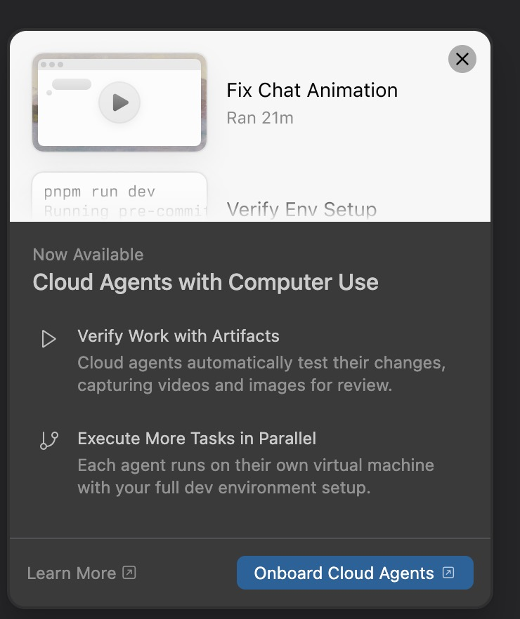

# ReleaseNotesModal Redesign Plan

## Design Reference



---

## Overview

Redesign the `ReleaseNotesModal` component
(`spa-change-detection/src/components/ReleaseNotesModal.tsx`) to match a modern
announcement-style modal. The new design replaces the current generic MUI Dialog with a
visually rich layout featuring a hero image with gradient fade, structured feature rows,
and a clear footer with dual CTAs.

The component consumes types exported from `@hopdrive/hotswap`, so changes span both
repositories:

| Repo | Scope |
|------|-------|
| `hotswap` | Extend `VersionNotes` type to support richer feature data |
| `spa-change-detection` | Rewrite the `ReleaseNotesModal` UI component |

---

## Current State

The existing modal is a standard MUI `<Dialog>` with:
- `DialogTitle` containing a single heading ("What's new -- v1.2.3")
- `DialogContent` with summary text, a bulleted list of plain strings, optional media,
  and a "View full release notes" link
- `DialogActions` with "Close" and optional "Reload now" buttons

### Current Data Model (`VersionNotes`)

```ts
interface VersionNotes {
  title: string;
  summary: string;
  bullets: string[];         // plain strings -- no structure
  learnMoreUrl?: string;
  media?: MediaItem[];
}
```

---

## Target Design Anatomy

The modal is composed of five visual zones stacked vertically:

```
+---------------------------------------+
|                                       |
|         1. HERO IMAGE ZONE            |
|         (top ~1/3 of modal)           |
|                                       |
|  ─── gradient fade ──────────────────>|
|                                       |
|  2. HEADING ZONE                      |
|     "Now Available"  (overline)       |
|     "Feature Name"   (h2, bold)       |
|                                       |
|  3. FEATURE ROWS                      |
|     [icon]  Bold Subheading           |
|             2-line description text   |
|                                       |
|     [icon]  Bold Subheading           |
|             2-line description text   |
|                                       |
|  ───────────────────────────────────  |
|  4. FOOTER                            |
|  Learn More [↗]       [CTA Button ↗] |
+---------------------------------------+
```

### Zone 1 -- Hero Image

- Occupies roughly the top third of the modal.
- Image is rendered edge-to-edge (no padding) using `object-fit: cover`.
- A **vertical gradient overlay** fades from transparent at the top to the modal's
  background color at the bottom, so the image appears to dissolve behind the text
  content below it.
- The image source comes from `notes.media[0]` (the first media item of type `image`).
- If no image is available, this zone is hidden and the modal starts at the heading.

#### Gradient Implementation

```tsx
<Box sx={{ position: 'relative', height: 200, overflow: 'hidden' }}>
  <Box
    component="img"
    src={heroImage.src}
    alt={heroImage.alt ?? ''}
    sx={{
      width: '100%',
      height: '100%',
      objectFit: 'cover',
    }}
  />
  {/* Gradient overlay */}
  <Box
    sx={{
      position: 'absolute',
      bottom: 0,
      left: 0,
      right: 0,
      height: '60%',
      background: (theme) =>
        `linear-gradient(to bottom, transparent, ${theme.palette.background.paper})`,
    }}
  />
</Box>
```

### Zone 2 -- Heading

- **Overline text**: Small, lighter weight text reading "Now Available" (or derived from
  impact level -- e.g. "Critical Update", "New Feature"). Uses `variant="overline"` or
  `caption` with `textTransform: 'uppercase'`, `letterSpacing: 1`, and a muted color.
- **Main heading**: Bold, large font. Uses `variant="h2"` (24px, weight 700) or `h3`
  (20px, weight 600) depending on modal width. Renders the `notes.title` value.
- Padding: `px: 3` to align with content below.

#### Overline Derivation Logic

```ts
function overlineForImpact(impact: Impact): string {
  switch (impact) {
    case 'critical': return 'Critical Update';
    case 'major':    return 'Now Available';
    case 'minor':    return 'New Feature';
    default:         return 'What\'s New';
  }
}
```

### Zone 3 -- Feature Rows

Each feature row consists of:
- **Left icon** (~24px, vertically centered with the subheading). The icon is specified
  per feature in the data as a string identifier (e.g. `"PlayArrow"`, `"AccountTree"`).
  Falls back to a default icon if not recognized.
- **Bold subheading** (body1, weight 600) on the first line.
- **Description text** (body2, weight 400, `color="text.secondary"`) on the second/third
  line. Should be 1-3 lines max.
- Rows are spaced with `gap: 2` (16px) between them.
- Padding: `px: 3`.

#### Row Layout

```tsx
<Box sx={{ display: 'flex', gap: 2, alignItems: 'flex-start', px: 3, py: 1 }}>
  <Box sx={{ mt: 0.5, color: 'text.secondary' }}>
    <FeatureIcon name={feature.icon} />
  </Box>
  <Box>
    <Typography variant="body1" sx={{ fontWeight: 600 }}>
      {feature.heading}
    </Typography>
    <Typography variant="body2" color="text.secondary">
      {feature.description}
    </Typography>
  </Box>
</Box>
```

### Zone 4 -- Footer

- Separated from content by a `<Divider />` (full-width horizontal line).
- **Left side**: "Learn More" as a text-only button (`variant="text"`) with an
  external-link icon (`OpenInNew`) to the right of the label. Links to
  `notes.learnMoreUrl`.
- **Right side**: Primary CTA button (`variant="contained"`, `color="primary"`) with an
  external-link icon (`OpenInNew`) to the right of the label. The label and URL come from
  new `ctaLabel` and `ctaUrl` fields on `VersionNotes`.
- Footer uses `display: 'flex'`, `justifyContent: 'space-between'`, `alignItems: 'center'`,
  `px: 2`, `py: 1.5`.

```tsx
<Divider />
<Box sx={{ display: 'flex', justifyContent: 'space-between', alignItems: 'center', px: 2, py: 1.5 }}>
  {notes.learnMoreUrl && (
    <Button
      variant="text"
      size="small"
      endIcon={<OpenInNewIcon />}
      href={notes.learnMoreUrl}
      target="_blank"
      rel="noopener noreferrer"
    >
      Learn More
    </Button>
  )}
  {notes.ctaUrl && (
    <Button
      variant="contained"
      size="small"
      endIcon={<OpenInNewIcon />}
      href={notes.ctaUrl}
      target="_blank"
      rel="noopener noreferrer"
    >
      {notes.ctaLabel ?? 'Get Started'}
    </Button>
  )}
</Box>
```

---

## Data Model Changes (hotswap repo)

### 1. Add `Feature` interface

New interface in `hotswap/src/core/types.ts`:

```ts
export interface Feature {
  icon?: string;       // MUI icon name, e.g. "PlayArrow", "AccountTree"
  heading: string;     // Bold subheading text
  description: string; // 1-3 line description
}
```

### 2. Extend `VersionNotes`

Add new optional fields alongside the existing `bullets` array so the change is
backward-compatible:

```ts
export interface VersionNotes {
  title: string;
  summary: string;
  bullets: string[];            // kept for backward compat / simple use
  features?: Feature[];         // NEW -- structured feature rows
  learnMoreUrl?: string;
  ctaLabel?: string;            // NEW -- primary CTA button label
  ctaUrl?: string;              // NEW -- primary CTA button URL
  media?: MediaItem[];
}
```

### 3. Export new type

Ensure `Feature` is exported from the package entry point alongside the existing types.

### 4. Update `generate-version-json.ts`

Add optional parsing support for features from `release-media.json` or a new
`release-features.json` keyed by version:

```json
{
  "1.2.3": {
    "features": [
      {
        "icon": "PlayArrow",
        "heading": "Verify Work with Artifacts",
        "description": "Cloud agents automatically test their changes, capturing videos and images for review."
      },
      {
        "icon": "AccountTree",
        "heading": "Execute More Tasks in Parallel",
        "description": "Each agent runs on their own virtual machine with your full dev environment setup."
      }
    ],
    "ctaLabel": "Onboard Cloud Agents",
    "ctaUrl": "https://example.com/onboard"
  }
}
```

---

## Component Changes (spa-change-detection repo)

### File: `src/components/ReleaseNotesModal.tsx`

#### Remove

- `DialogTitle`, `DialogContent`, `DialogActions` wrappers (replace with custom layout)
- `List`, `ListItem`, `ListItemIcon`, `ListItemText`, `CircleIcon` imports
- Current bullet-list rendering
- "Close" and "Reload now" button actions (replaced by new footer)

#### Add Imports

```tsx
import Divider from '@mui/material/Divider';
import OpenInNewIcon from '@mui/icons-material/OpenInNew';
import type { Feature } from '@hopdrive/hotswap';
```

#### New Internal Components

1. **`HeroImage`** -- Renders the image with gradient overlay. Accepts the first
   `MediaItem` of type `image` from `notes.media`.

2. **`FeatureIcon`** -- Maps a string icon name to an MUI icon component. Uses a lookup
   object for supported icons, falls back to a default (e.g. `InfoOutlined`).

3. **`FeatureRow`** -- Renders a single feature with icon, heading, and description.

#### Updated Props

The component's props remain largely the same. `showReload` and `onReload` can be
retained for backward compat but are no longer used by the new footer design. If the
consuming app still needs a reload action, it can be wired to the CTA button via
`notes.ctaUrl` or a callback.

```ts
export interface ReleaseNotesModalProps {
  open: boolean;
  notes: VersionNotes;
  version: string;
  impact: Impact;              // NEW -- needed for overline text
  onClose: () => void;
  onReload?: () => void;       // optional, kept for compat
}
```

#### Dialog Configuration

```tsx
<Dialog
  open={open}
  onClose={onClose}
  maxWidth="sm"
  fullWidth
  PaperProps={{
    sx: {
      borderRadius: '12px',   // radius.lg
      overflow: 'hidden',     // so hero image respects border radius
    },
  }}
>
```

#### Full Component Structure (Pseudocode)

```tsx
<Dialog ...>
  {/* Zone 1: Hero */}
  {heroImage && <HeroImage media={heroImage} />}

  {/* Zone 2: Heading */}
  <Box sx={{ px: 3, pt: heroImage ? 0 : 3, pb: 1 }}>
    <Typography variant="overline" color="text.secondary">
      {overlineForImpact(impact)}
    </Typography>
    <Typography variant="h2" sx={{ fontWeight: 700 }}>
      {notes.title}
    </Typography>
  </Box>

  {/* Zone 3: Features */}
  <Box sx={{ px: 3, py: 2, display: 'flex', flexDirection: 'column', gap: 2 }}>
    {(notes.features ?? []).map((f, i) => (
      <FeatureRow key={i} feature={f} />
    ))}
  </Box>

  {/* Zone 4: Footer */}
  <Divider />
  <Box sx={{
    display: 'flex',
    justifyContent: 'space-between',
    alignItems: 'center',
    px: 2,
    py: 1.5,
  }}>
    {notes.learnMoreUrl && (
      <Button variant="text" endIcon={<OpenInNewIcon />} href={notes.learnMoreUrl} ...>
        Learn More
      </Button>
    )}
    <Box sx={{ flex: 1 }} />
    {notes.ctaUrl && (
      <Button variant="contained" endIcon={<OpenInNewIcon />} href={notes.ctaUrl} ...>
        {notes.ctaLabel ?? 'Get Started'}
      </Button>
    )}
  </Box>
</Dialog>
```

---

## HopDrive Design Token Mapping

| Element | Token / Value |
|---------|---------------|
| Modal border radius | `radius.lg` = 12px |
| Modal elevation | `elevation.level4` |
| Overline text | `typography.overline` -- 11px, weight 600, uppercase |
| Main heading | `typography.h2` -- 24px, weight 700 |
| Feature subheading | `typography.body1` -- 15px, weight 600 (override) |
| Feature description | `typography.body2` -- 14px, weight 400, `text.secondary` |
| Content padding horizontal | `spacing.xl` = 24px (sx `px: 3`) |
| Feature row gap | `spacing.md` = 16px (sx `gap: 2`) |
| Footer padding | `spacing.md` x `spacing.sm` (sx `px: 2, py: 1.5`) |
| CTA button | `variant="contained"`, `color="primary"` (uses `primaryAccent`) |
| Learn More button | `variant="text"`, default text color |
| Divider | Default MUI `<Divider />` |
| Gradient overlay | `transparent` to `theme.palette.background.paper` |
| Hero image height | ~200px (adjustable) |
| Animation (enter) | `animation.enter` = 250ms ease-out |

---

## Backward Compatibility

- The `bullets` field on `VersionNotes` is retained. If `features` is not provided, the
  component should fall back to rendering `bullets` in a simple list (similar to current
  behavior but styled to match the new design).
- The `showReload` and `onReload` props are kept as optional on the component for
  consuming apps that still need them. If present, a reload action can be shown in the
  footer alongside the CTA.
- The overline text defaults to "What's New" if `impact` is not passed.

---

## Migration Checklist

- [ ] Add `Feature` interface to `hotswap/src/core/types.ts`
- [ ] Add `features?`, `ctaLabel?`, `ctaUrl?` fields to `VersionNotes`
- [ ] Export `Feature` from package entry point
- [ ] Update `generate-version-json.ts` to support features data
- [ ] Rewrite `ReleaseNotesModal` in spa-change-detection with new layout
- [ ] Add `HeroImage` sub-component with gradient overlay
- [ ] Add `FeatureIcon` mapping sub-component
- [ ] Add `FeatureRow` sub-component
- [ ] Update `ReleaseNotesModalProps` to accept `impact`
- [ ] Wire up footer with "Learn More" text button and primary CTA
- [ ] Add fallback rendering for `bullets` when `features` is absent
- [ ] Test with and without hero image
- [ ] Test with and without features/CTA data
- [ ] Verify HopDrive design token compliance
